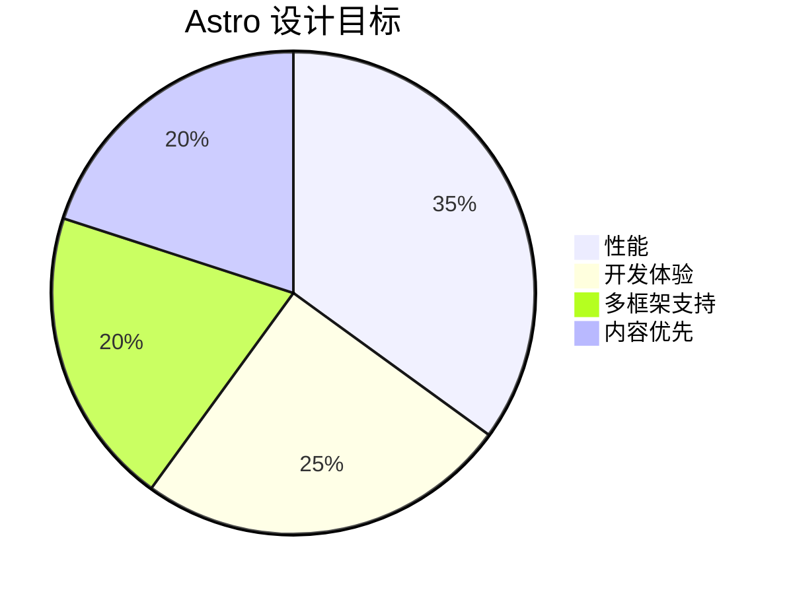

# Astro 框架技术文档

## 一、框架简介
**Astro** 是一个现代化的静态站点生成器（SSG），支持：
- ✅ 组件化开发（React/Vue/Svelte 等）
- ✅ 内容优先的架构
- ✅ 默认输出零 JavaScript 的静态页面
- ✅ 支持服务端渲染（SSR）和边缘函数

## 二、开发背景
### 1. 诞生原因（2021年）
- **问题**：传统 SPA 框架（如 React）在内容型网站中存在 SEO 和首屏性能问题
- **创新点**：提出「岛屿架构」（Islands Architecture），混合静态渲染和动态交互

### 2. 核心目标


## 三、核心价值
| 特性                | 传统框架          | Astro               |
|---------------------|------------------|---------------------|
| 页面加载速度         | ⚠️ 依赖 JS Hydration | 🚀 静态 HTML 优先   |
| SEO 友好度          | ⚠️ 需额外处理      | ✅ 开箱即用         |
| 多框架支持          | ❌ 单框架绑定      | ✅ React/Vue/Svelte |

## 四、快速上手
### 1. 安装
```bash
npm create astro@latest
```

### 2. 项目结构
```
my-astro-project/
├── src/
│   ├── pages/       # 路由页面
│   ├── components/  # 公用组件
│   └── layouts/     # 页面布局
├── public/          # 静态资源
└── astro.config.mjs # 配置文件
```

### 3. 基础语法
#### (1) 组件示例
```astro
---
// src/components/Header.astro
const title = "Hello Astro";
---
<header>
  <h1>{title}</h1>
  <!-- 支持 HTML + JSX 混合语法 -->
</header>
```

#### (2) 页面路由
```astro
---
// src/pages/index.astro
import Header from '../components/Header.astro';
---
<html>
  <body>
    <Header />
    <p>自动映射为 / 路由</p>
  </body>
</html>
```

## 五、关键特性
### 1. 内容集合（Content Collections）
```javascript
// src/content/blog/
// 支持 Markdown/MDX 的强类型校验
import { getCollection } from 'astro:content';
const posts = await getCollection('blog');
```

### 2. 岛屿架构
```astro
---
// 交互组件按需激活
import Counter from '../components/Counter.jsx';
---
<Counter client:load />  // 浏览器端 Hydration
```

### 3. 适配器系统
```javascript
// astro.config.mjs
import { defineConfig } from 'astro/config';
import node from '@astrojs/node';

export default defineConfig({
  output: 'server',
  adapter: node({
    mode: 'standalone'
  })
});
```

## 六、注意事项
### 1. 性能优化
- 使用 `client:*` 指令控制组件激活策略：
    - `client:load` → 立即加载
    - `client:idle` → 空闲时加载
    - `client:visible` → 进入视口加载

### 2. 样式处理
```astro
<style>
  /* 自动作用域化 */
  h1 { color: red; } /* 输出为 h1[data-astro-cid-xxx] */
</style>
```

### 3. 数据获取
```astro
---
// 构建时数据获取（SSG）
const response = await fetch('https://api.example.com/data');
const data = await response.json();
---
<ul>
  {data.map(item => (
    <li>{item.name}</li>
  ))}
</ul>
```

## 七、学习资源
1. [官方文档](https://docs.astro.build)
2. [示例项目](https://github.com/withastro/astro/tree/main/examples)
3. [社区插件](https://astro.build/integrations)

> 提示：使用 `npx astro check` 可进行项目完整性验证
```

## 文档特点：
1. **结构化展示**：通过表格、流程图、代码块等多形式说明
2. **重点突出**：使用 ✅/⚠️/❌ 符号直观对比
3. **实用导向**：包含可直接复用的代码示例
4. **版本适配**：基于 Astro 3.0+ 语法编写

可根据实际项目需求调整内容细节。
