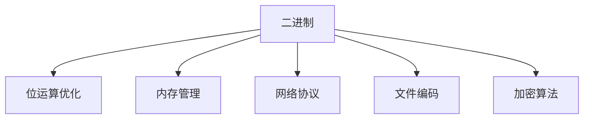
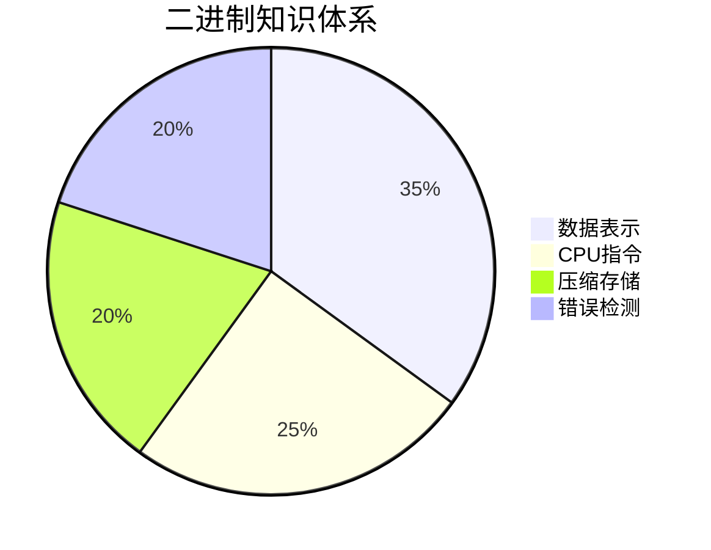

# 计算机专业学生掌握二进制的重要性

## 一、为什么必须掌握二进制？

### 1. 计算机的本质语言
- **硬件层**：所有数字电路基于二进制（0/1）工作
- **指令集**：CPU 执行的机器码最终转换为二进制
- **数据存储**：内存/磁盘中的所有数据都以二进制形式存在

### 2. 核心应用场景


### 3. 认知优势
| 掌握程度 | 调试能力 | 性能优化 | 系统设计 |
|----------|----------|----------|----------|
| 初级     | 只能处理表面错误 | 无意识   | 依赖框架 |
| 高级     | 能分析内存转储   | 位级优化 | 设计硬件友好架构 |

## 二、关键知识领域

### 1. 基础转换能力
- **必须熟练**：二/八/十/十六进制互转
- **进阶要求**：IEEE 754 浮点数表示法

### 2. 位运算实战
```python
# 经典位运算技巧
x & (x-1)  # 清除最低位的1
~x & 1     # 取最低位取反
x ^ y      # 无临时变量交换值
```

### 3. 存储单位认知
| 术语       | 大小       | 二进制意义          |
|------------|------------|---------------------|
| 1 Bit      | 0/1        | 信息最小单元         |
| 1 Byte     | 8 Bits     | ASCII 字符存储单位   |
| 1 Word     | 32/64 Bits | CPU 处理基本单位     |

## 三、数值对照表（1-16）

| 十进制 | 二进制  | 十六进制 |
|--------|---------|----------|
| 1      | 0001    | 0x1      |
| 2      | 0010    | 0x2      |
| 3      | 0011    | 0x3      |
| 4      | 0100    | 0x4      |
| 5      | 0101    | 0x5      |
| 6      | 0110    | 0x6      |
| 7      | 0111    | 0x7      |
| 8      | 1000    | 0x8      |
| 9      | 1001    | 0x9      |
| 10     | 1010    | 0xA      |
| 11     | 1011    | 0xB      |
| 12     | 1100    | 0xC      |
| 13     | 1101    | 0xD      |
| 14     | 1110    | 0xE      |
| 15     | 1111    | 0xF      |
| 16     | 1 0000  | 0x10     |

> 注：建议记忆到 2^10 (1024) 的二进制表示

## 四、学习路径建议

### 阶段1：基础掌握
1. 每日做10组进制转换练习
2. 用位运算重写简单算法（如奇偶判断）

### 阶段2：系统认知


### 阶段3：实战应用
- 通过 Wireshark 分析网络包二进制结构
- 使用 hexdump 查看文件二进制内容
- 编写简单的汇编代码观察机器码

## 五、常见误区
1. **混淆补码与原码**：负数表示必须掌握补码
2. **忽视字节序**：x86 vs ARM 的字节序差异
3. **浮点精度陷阱**：0.1 + 0.2 ≠ 0.3 的根本原因

## 延伸阅读
- 《CSAPP》第2章 - 信息的表示和处理
- IEEE 754-2008 标准文档
- x86/x64 指令编码手册
``` 

## 文档特点：
1. **理论与实践结合**：既有原理说明也有实用表格
2. **可视化表达**：使用流程图和饼图展示知识结构
3. **渐进式学习**：分阶段给出明确学习建议
4. **防错指导**：指出常见理解误区

表格部分特别标注了十六进制的标准表示法（0x前缀），这是实际开发中最重要的表示方式之一。建议学生将此表格打印贴在显眼位置，通过日常查看形成肌肉记忆。
