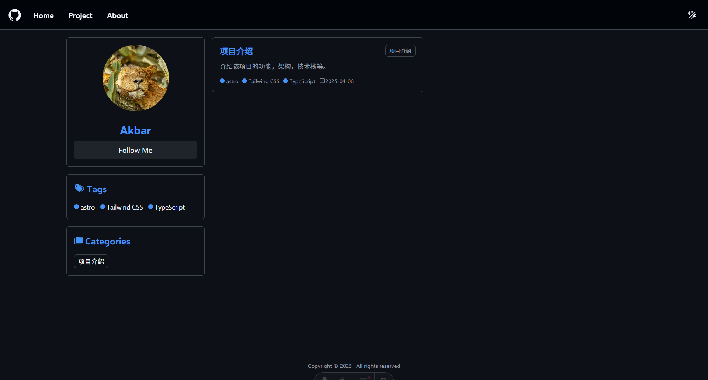
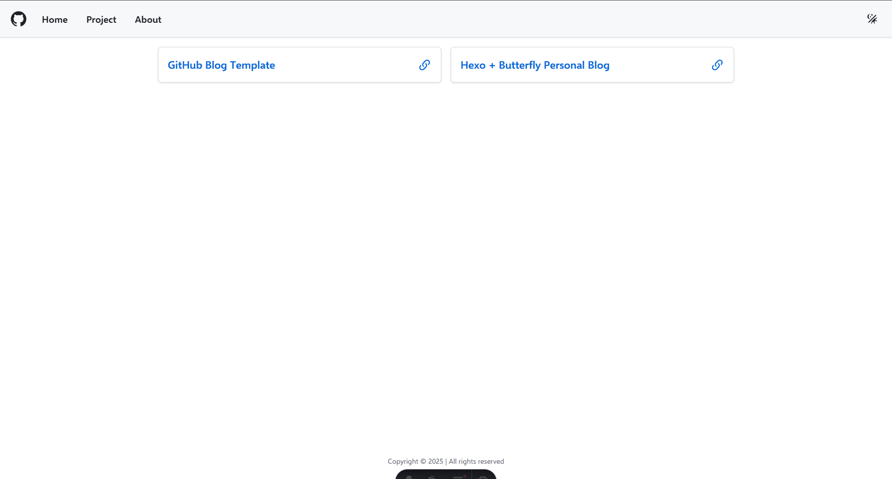
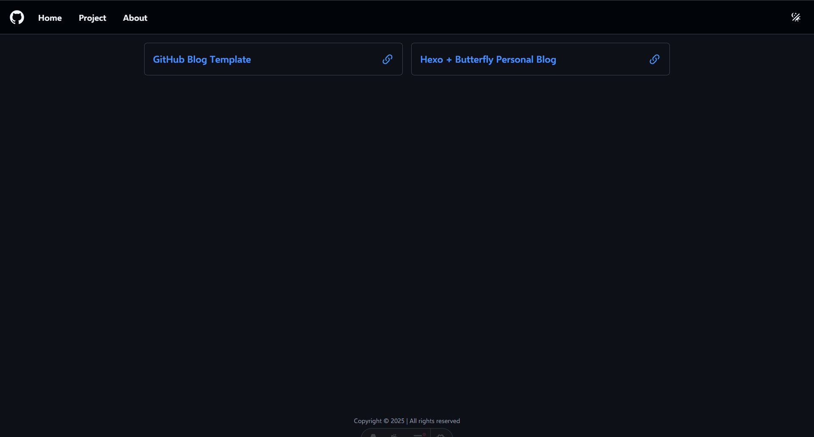
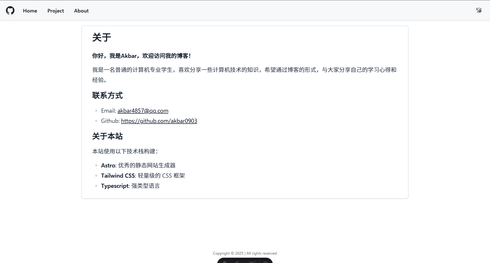
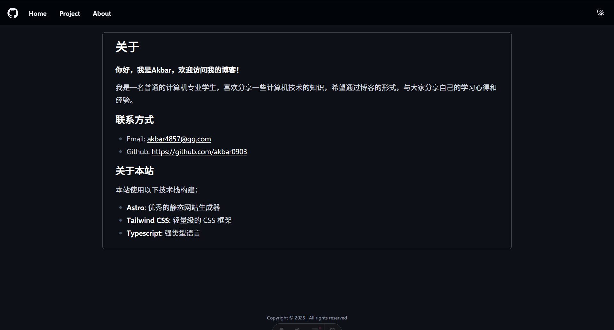
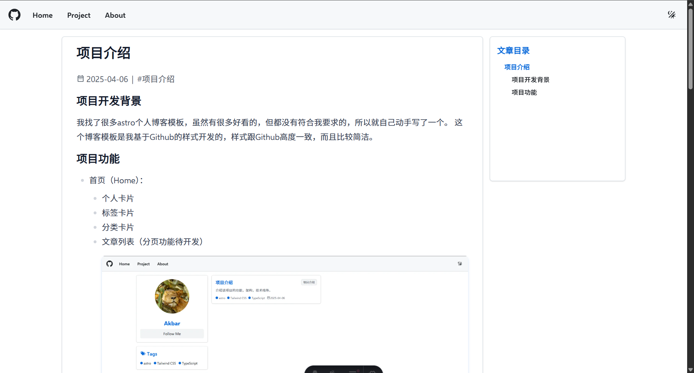
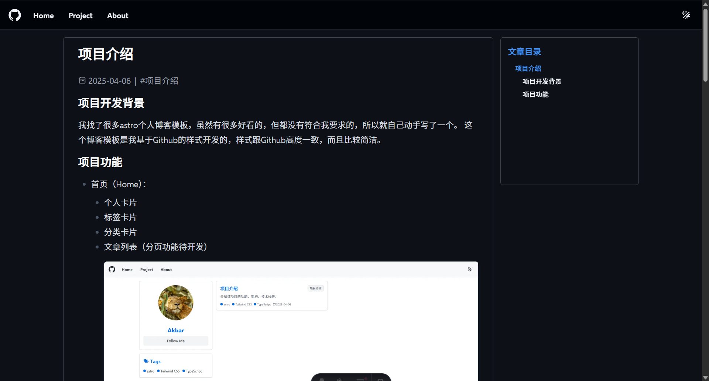

## 项目开发背景
我找了很多astro个人博客模板，虽然有很多好看的，但都没有符合我要求的，所以就自己动手写了一个。
这个博客模板是我基于Github的样式开发的，样式跟Github高度一致，而且比较简洁。

## 项目功能
- 首页（Home）：
  - 个人卡片
  - 标签卡片
  - 分类卡片
  - 文章列表（分页功能待开发）


- 项目页（Project）：
  - 项目卡片，可以通过`project-data.ts`文件配置项目信息


- 关于页（About）：
  - 个人信息
  - 联系方式
  - 技术栈


- 文章页（Post）：



## 关于页面内容编写
直接可以在`src/pages/about/about.md`中编写就可以了，比如：
```markdown title="src/pages/about/about.md"
# 关于

**你好，我是Akbar，欢迎访问我的博客！**

我是一名普通的计算机专业学生，喜欢分享一些计算机技术的知识，希望通过博客的形式，与大家分享自己的学习心得和经验。

## 联系方式

- Email: akbar4857@qq.com
- Github: https://github.com/akbar0903

## 关于本站
本站使用以下技术栈构建：

- **Astro**: 优秀的静态网站生成器
- **Tailwind CSS**: 轻量级的 CSS 框架
- **Typescript**: 强类型语言
```
如果需要自定义样式或者结构，可以直接在`src/pages/about/about.astro`文件中编写，比如：
```typescript title="src/pages/about/about.astro"
---
import Layout from '../../layouts/Layout.astro'
import { Content } from './about.md'
---

<Layout title="关于我">
    <div class="max-w-5xl mx-auto">
        <article class="my-4">
            <Content />
        </article>
    </div>
</Layout>
```

## 文章页面内容编写
直接可以在`src/pages/posts/xxx.md`中编写文章内容，比如：
```markdown title="src/pages/posts/xxx.md"
---
layout: ../../layouts/MarkdownPostLayout.astro
title: 项目介绍
description: 介绍该项目的功能，架构，技术栈等。
tags: ['astro', 'Tailwind CSS', 'TypeScript']
category: '项目介绍'
date: '2025-04-06'
---

## 项目开发背景
我找了很多astro个人博客模板，虽然有很多好看的，但都没有符合我要求的，所以就自己动手写了一个。
这个博客模板是我基于Github的样式开发的，样式跟Github高度一致，而且比较简洁。
```
<mark>注意，frontmatter暂时只能处理下面的内容：</mark>
```markdown
layout: ../../layouts/MarkdownPostLayout.astro
title: 项目介绍
description: 介绍该项目的功能，架构，技术栈等。
tags: ['astro', 'Tailwind CSS', 'TypeScript']
category: '项目介绍'
date: '2025-04-06
```
如果需要自定义，在`src/layouts/MarkdownPostLayout.astro`中修改即可。
```typescript
---
import Layout from './Layout.astro'
import ArticleToc from "../components/ArticleToc.astro";
import { Icon } from "astro-icon/components";

const { frontmatter } = Astro.props
const { headings } = Astro.props
---

<Layout title={ frontmatter.title }>
    <div class="grid grid-cols-1 md:grid-cols-4 gap-4 my-4 md:m-4">
        <article>
            <h1>{ frontmatter.title }</h1>
            <div class="flex items-center gap-2 text-content-secondary">
                <div class="flex items-center gap-1">
                    <Icon name="mdi:calendar-range-outline"/>
                    <span>{ frontmatter.date }</span>
                </div>
                <span>|</span>
                <span>#{ frontmatter.category }</span>
            </div>
            <!-- article content -->
            <slot/>
        </article>

        <div class="hidden md:block w-full md:col-span-1 relative">
            <div class="sticky top-20 max-h-1/2 h-80 flex flex-col card-style">
                <h3 class="font-semibold text-lg mb-2 text-primary">文章目录</h3>
                <div class="flex-1 overflow-y-auto overflow-x-hidden toc-wrapper">
                    <ArticleToc headings={ headings }/>
                </div>
            </div>
        </div>
    </div>
</Layout>
```
文章内容的样式，我使用了tailwindcss的插件`tailwindcss-typography`，它的默认样式有点不好看，所有我在`src/styles/global.css`中修改了一些样式。
```css title="src/styles/global.css"
  article {
    @apply w-full md:col-span-3 card-style md:px-8 !max-w-none;

    /* Typography 基础 */
    @apply prose md:prose-lg dark:prose-invert;

    /* 标题大小调整 */
    @apply prose-h1:text-xl md:prose-h1:text-2xl lg:prose-h1:text-3xl;
    @apply prose-h2:text-lg md:prose-h2:text-xl lg:prose-h2:text-2xl prose-h2:my-4;
    @apply prose-h3:text-base md:prose-h3:text-lg lg:prose-h3:text-xl prose-h3:my-4;
    @apply prose-h4:text-sm md:prose-h4:text-base lg:prose-h4:text-lg;

    /* 段落p标签 */
    @apply prose-p:my-3 prose-p:before:content-none prose-p:after:content-none;

    /* 引用块样式 */
    @apply prose-blockquote:border-l-4 prose-blockquote:border-l-primary prose-blockquote:bg-hover-back prose-blockquote:my-4;

    /* ul无序列表样式 */
    @apply prose-ul:my-2 prose-li:!my-0 prose-li:pl-0;

    /* ol 有序列表样式 */
    @apply prose-ol:my-2 prose-li:!my-0;

    /* 行内代码样式 */
    @apply prose-code:before:content-none prose-code:after:content-none;
    @apply prose-code:bg-hover-back prose-code:p-0.5 prose-code:rounded-md;

    /* 代码块样式 */
    @apply prose-pre:p-0 prose-pre:my-4 prose-pre:rounded-lg;

    /* 水平线样式 */
    @apply prose-hr:my-4;

    /* 图片样式 */
    @apply prose-img:my-4 prose-img:rounded-md prose-img:shadow-md prose-img:shadow-primary/20;
  }
}
```

## 文章目录生成器
因为，我的技术水平有限，所以文章目录生成功能的代码是`deepseek`给我生成的，具体代码请在`src/components/ArticleToc.astro`中查看。
```typescript title="src/components/ArticleToc.astro"
<div class="toc-wrapper">
    <nav id="toc-container" class="space-y-1 pl-4">
        <!-- 客户端动态生成内容 -->
    </nav>
</div>

<script is:inline>
    document.addEventListener('DOMContentLoaded', () => {
        // 1. 构建层级结构（支持h1-h3）
        const tocTree = [];
        let currentH1 = null;
        let currentH2 = null;

        Array.from(document.querySelectorAll('article h1, article h2, article h3')).forEach((el, index) => {
            const depth = parseInt(el.tagName.substring(1));
            const item = {
                text: el.textContent,
                slug: el.id || `heading-${index}`,
                depth: depth
            };

            // 构建树形结构
            if (depth === 1) {
                currentH1 = { ...item, children: [] };
                currentH2 = null;
                tocTree.push(currentH1);
            }
            else if (depth === 2 && currentH1) {
                currentH2 = { ...item, children: [] };
                currentH1.children.push(currentH2);
            }
            else if (depth === 3 && currentH2) {
                currentH2.children.push(item);
            }

            if (!el.id) el.id = item.slug;
        });

        // 2. 渲染函数（纯缩进层级）
        const renderTOC = (items) => {
            return items.map(item => `
        <div class="toc-item level-${item.depth}">
          <a href="#${item.slug}" class="
            block py-1 text-sm transition-colors
            ${item.depth === 1 ? 'font-bold text-content-primary' : ''}
            ${item.depth === 2 ? 'font-medium text-content-primary' : ''}
            ${item.depth === 3 ? 'font-normal text-content-secondary' : ''}
            hover:text-primary
          ">
            ${item.text}
          </a>
          ${item.children?.length ? `
            <div class="ml-4">${renderTOC(item.children)}</div>
          ` : ''}
        </div>
      `).join('');
        };

        document.getElementById('toc-container').innerHTML = renderTOC(tocTree);

        // 3. 交互逻辑
        const activateToc = () => {
            // 平滑滚动（修复特殊字符问题）
            document.querySelectorAll('#toc-container a').forEach(link => {
                link.addEventListener('click', (e) => {
                    e.preventDefault();
                    const href = link.getAttribute('href');
                    const id = href.slice(1); // 移除开头的#
                    try {
                        const target = document.querySelector(`#${CSS.escape(id)}`);
                        if (target) {
                            const headerHeight = document.querySelector('header')?.offsetHeight || 0;
                            window.scrollTo({
                                top: target.offsetTop - headerHeight - 20,
                                behavior: 'smooth'
                            });
                        }
                    } catch (e) {
                        console.error('TOC导航失败:', e);
                    }
                });
            });

            // 滚动高亮（修复观察器错误）
            const headings = document.querySelectorAll('article h1, article h2, article h3');
            const observer = new IntersectionObserver(entries => {
                entries.forEach(entry => {
                    const id = entry.target.id;
                    try {
                        const link = document.querySelector(`#toc-container a[href="#${CSS.escape(id)}"]`);
                        link?.classList.toggle('active', entry.isIntersecting);
                    } catch (e) {
                        console.error('TOC高亮失败:', e);
                    }
                });
            }, {
                rootMargin: '-10% 0px -75% 0px',
                threshold: 0.1
            });

            // 关键修复：遍历每个标题元素分别观察
            headings.forEach(heading => {
                observer.observe(heading); // ✔️ 正确用法
            });
        };

        activateToc();
    });
</script>
```

## 未来规划
- 增减文章分页功能
- 增加一键回到顶部功能
因为现在时间有限，所以功能还不够完善，后续会继续完善。
